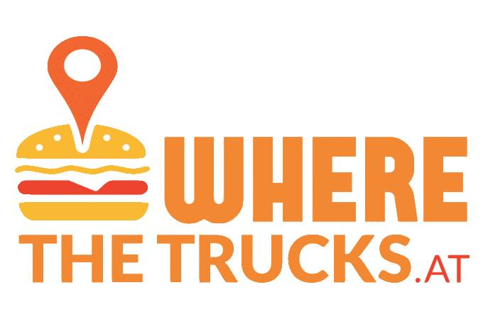

 #Where the Trucks At? 
 
 
Crowdsourced WebApp for Locating Food Trucks 
NETS213 Final Project: Ella Polo, Samay Dhawan, Jason Woo, Victor Yoon, Kevin Zhai 

This app will let users locate locations of food trucks, with geographic information gathered from crowdworkers.  
Milestones:  
-Gathering pictures of food trucks and their menus; Having crowd workers transcribe menu items (4 points)  
-Posting user-friendly hits on Crowdflower in order to extract information (3 points)   
-QC of crowd information (1 point)   
-Data aggregation into SQL (MongoDB?) database (3 points)  
-Build webapp using Javascript with interactive map (4 points)  

#Data: 
 
  ###Raw Data:
  	First, we will take images of food trucks and their menus. This can be done by ourselves or through Field Agent. 
	The images are then hosted on Dropbox. From this, we generate a CSV file of Image URLs that we can upload to CrowdFlower for our HITs. 

  ###Quality Control Data: 
  	After our HITs are completed, we download the result as a CSV file and pass it as input to our QC. 
  	The output file will also be in CSV format. 
  
  ###Aggregation Data: 
  	The output from Quality Control will be the input for our Aggregation. Our Aggregation Module will take the CSV file and generate a json file which contains all the information our web app will need.  
  
   Sample Data for all the above is in our Data folder. 
  
#Modules:
 
All the below components are located in our SRC folder.  

  ###Quality Control Module: 
  	We will implement 2 measures for QC. First, we designed a 2nd pass HIT (see the PNGs) and will rely on crowd workers to monitor previous results. Additionally, we have a script to filter results based on majority vote (see quality_control.py). From these 2 methods, we generate a CSV file to be passed on to our Aggregation Module.  
  
  ###Aggregation Module: 
  	From the QC output, we will be running a python script (see aggregation.py) to comb through the CSV file and compile the menu items for each food truck into a json file. This will facilitate embedding the data into our web app. 
  

  

  
  

